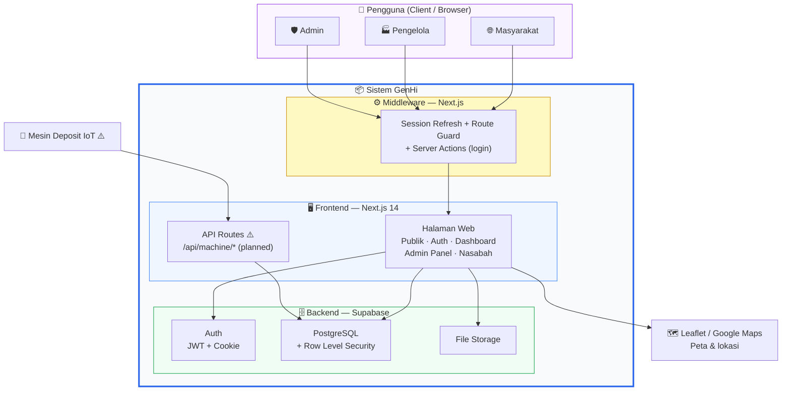
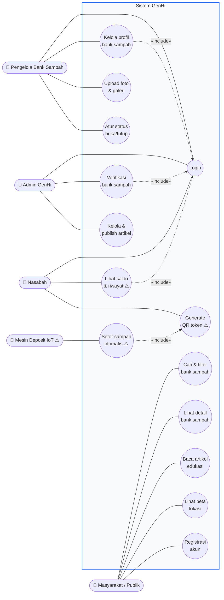
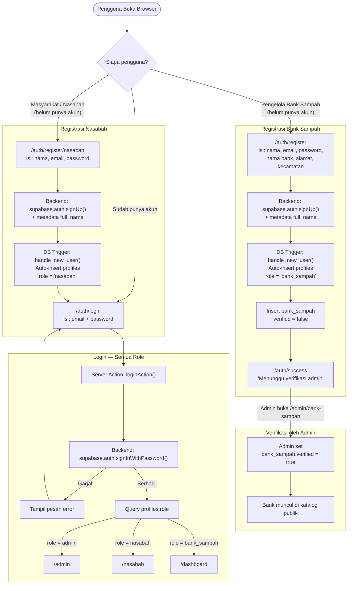
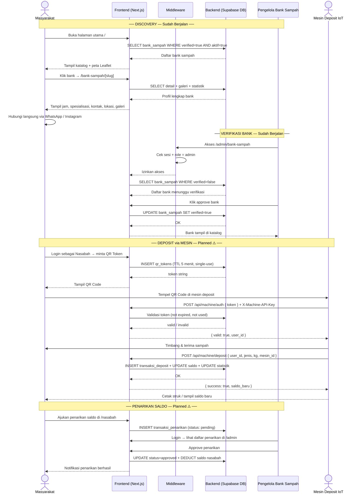
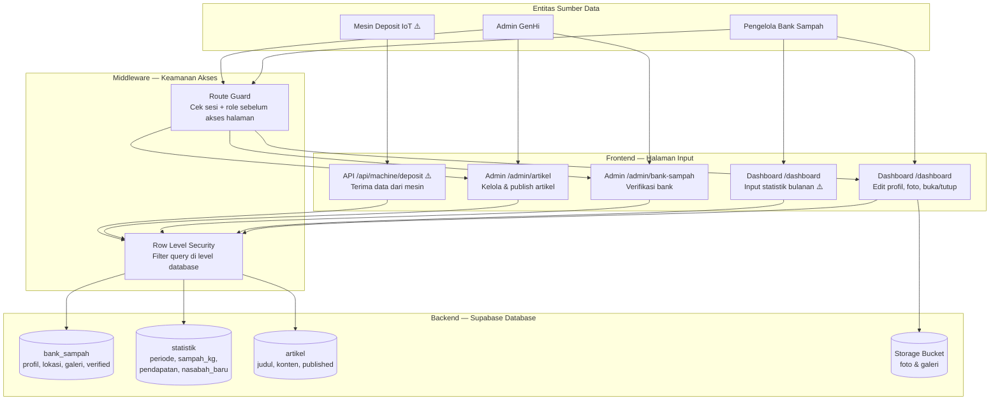
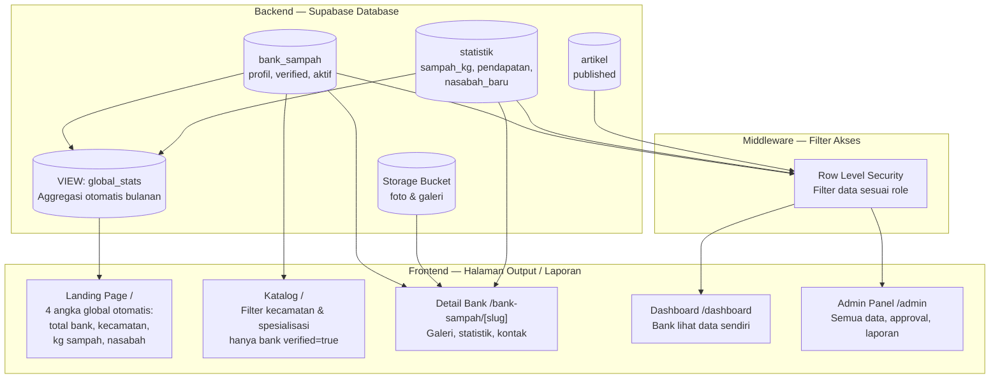

# GenHi — Diagram Arsitektur & Alur Sistem

---

## 1. Diagram Arsitektur Sistem

Diagram menampilkan struktur sistem secara umum: kotak "Sistem GenHi" berisi tiga lapisan container (Frontend, Middleware, Backend). Aktor pengguna berada di luar sistem, dan layanan eksternal menjadi sandaran sistem.

**Keterangan:**
- **👥 Pengguna** — masyarakat, pengelola, dan admin lewat browser; **mesin IoT** perangkat di luar browser yang langsung memanggil API
- **⚙️ Middleware** — pintu masuk semua request: refresh sesi, blokir route protected jika belum login, jalankan Server Action login
- **🖥️ Frontend** — seluruh halaman Next.js + API Routes mesin (⚠️ planned)
- **🗄️ Backend** — Supabase: Auth, PostgreSQL (dengan RLS), File Storage
- **🗺️ Layanan Eksternal** — Leaflet & Google Maps
- ⚠️ = masih dalam tahap perencanaan

---

## 2. Diagram Use Case

Menggambarkan **siapa bisa melakukan apa** di sistem. Tiap aktor terhubung ke fungsi (use case) yang boleh ia akses. Garis putus-putus `..>` menandai relasi `«include»` (use case wajib dijalankan lebih dulu).

**Keterangan:**
- **Masyarakat** — akses publik tanpa login: cari, lihat detail, baca artikel, lihat peta, dan registrasi
- **Pengelola** — setelah login: kelola profil bank, upload foto, atur status buka/tutup
- **Admin** — setelah login: verifikasi bank sampah & kelola artikel
- **Nasabah** ⚠️ — setelah login: lihat saldo, generate QR token
- **Mesin IoT** ⚠️ — setor sampah otomatis (memvalidasi QR token nasabah)
- ⚠️ = use case masih dalam tahap perencanaan

---

## 3. Diagram Alir Registrasi & Autentikasi Pengguna

---

## 4. Diagram Alir Komunikasi Masyarakat ↔ Pengelola Bank Sampah

---

## 5. Diagram Alir Pengelolaan Data

Menggambarkan **alur masuknya data** ke sistem: dari sumber data (pengelola, admin, mesin) → halaman input → melewati pemeriksaan keamanan → tersimpan di database.

**Keterangan:**
- Semua akses ke halaman input protected melewati **Route Guard** (cek sesi + role) lebih dulu
- Semua perubahan data difilter **Row Level Security** — pengelola hanya bisa menulis data miliknya sendiri, admin punya akses penuh
- File foto/galeri disimpan terpisah di **Storage Bucket**, hanya URL-nya yang masuk ke tabel
- ⚠️ = fitur masih dalam tahap perencanaan

---

## 6. Diagram Alir Pelaporan Aktivitas Persampahan

Menggambarkan **alur keluarnya data** menjadi laporan: dari data tersimpan → agregasi otomatis → ditampilkan di halaman output sesuai hak akses tiap pengguna.

**Keterangan:**
- **Laporan publik** (Landing, Katalog, Detail) — menampilkan data terbuka tanpa perlu login; angka global dihitung otomatis oleh view `global_stats`
- **Laporan ter-proteksi** (Dashboard, Admin) — difilter **Row Level Security**: pengelola hanya melihat data banknya sendiri, admin melihat semua
- `global_stats` mengagregasi data dari `bank_sampah` dan `statistik` secara otomatis tanpa input manual
