# Diagram Hak Paten — Sistem Manajemen Jaringan Informasi dan Komunikasi Digital antar Pengumpul dan Pengelola Sampah Berbasis Web

> Diagram disusun menyesuaikan **Uraian Gambar** dan **Uraian Lengkap Invensi** pada dokumen paten.
> Penomoran komponen mengacu pada deskripsi: server aplikasi (101), basis data (102), antarmuka web pengguna (103), modul pemetaan lokasi (104), modul komunikasi digital (105), modul pengelolaan data sampah (106), dan modul pelaporan (107).
>
> Catatan: sesuai kaidah penulisan paten, diagram menggunakan **istilah fungsional generik** (bukan nama teknologi tertentu) agar invensi tidak terikat pada implementasi spesifik.

---

## Gambar 1 — Diagram Arsitektur Sistem

*Diagram arsitektur sistem manajemen jaringan informasi dan komunikasi digital antar pengumpul dan pengelola sampah berbasis web.*

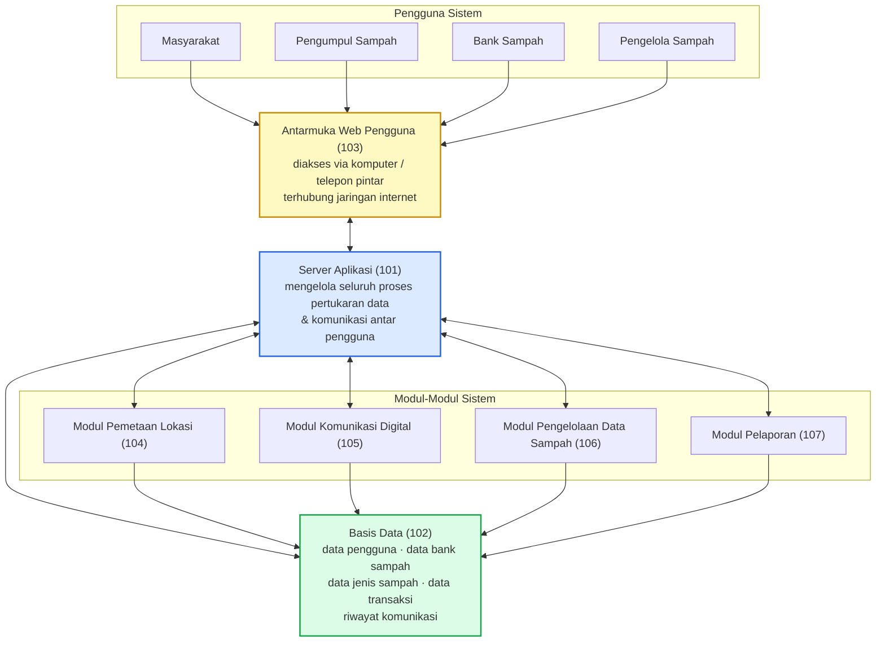

**Uraian:** Sistem terdiri atas server aplikasi (101) sebagai pusat pengelola seluruh proses, basis data (102) sebagai penyimpan data, antarmuka web pengguna (103) sebagai sarana akses, serta empat modul fungsional (104, 105, 106, 107). Seluruh pengguna — masyarakat, pengumpul sampah, bank sampah, dan pengelola sampah — mengakses sistem melalui antarmuka web pengguna (103) yang terhubung ke server aplikasi (101).

---

### Rincian Komponen Gambar 1

> Sub-bagian berikut menguraikan setiap komponen pada Gambar 1 secara lebih rinci beserta penomoran sub-komponennya.

#### 1.101 — Server Aplikasi (101)

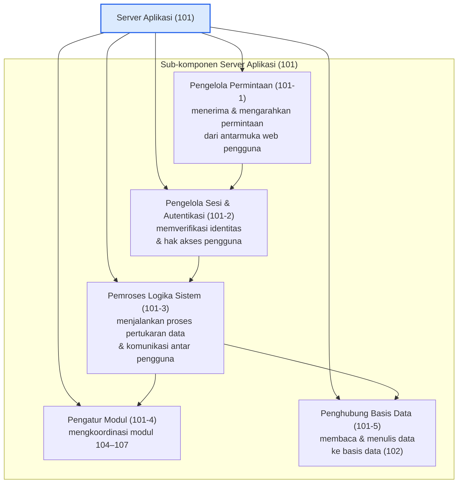

**Uraian:** Server aplikasi (101) terdiri atas pengelola permintaan (101-1), pengelola sesi & autentikasi (101-2), pemroses logika sistem (101-3), pengatur modul (101-4), dan penghubung basis data (101-5). Komponen ini berfungsi mengelola seluruh proses pertukaran data dan komunikasi antar pengguna sistem.

---

#### 1.102 — Basis Data (102)

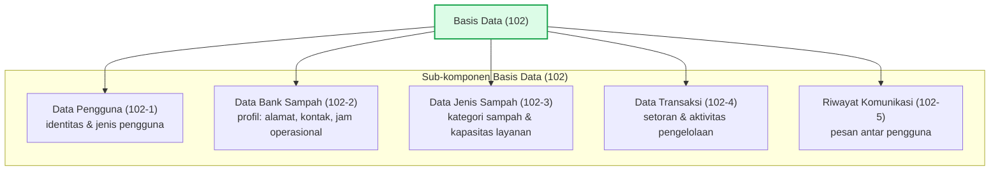

**Uraian:** Basis data (102) menyimpan data pengguna (102-1), data bank sampah (102-2), data jenis sampah (102-3), data transaksi (102-4), serta riwayat komunikasi (102-5).

---

#### 1.103 — Antarmuka Web Pengguna (103)

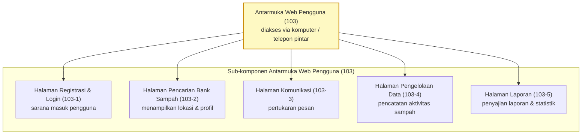

**Uraian:** Antarmuka web pengguna (103) dapat diakses menggunakan komputer maupun telepon pintar yang terhubung internet, dan menyediakan halaman registrasi & login (103-1), halaman pencarian bank sampah (103-2), halaman komunikasi (103-3), halaman pengelolaan data (103-4), serta halaman laporan (103-5).

---

#### 1.104 — Modul Pemetaan Lokasi (104)

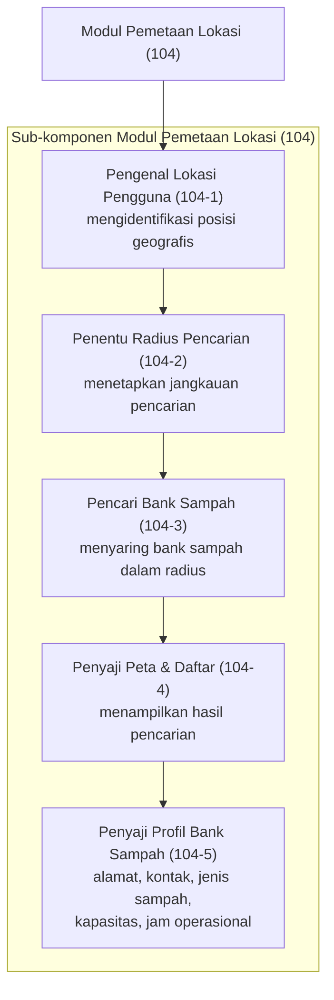

**Uraian:** Modul pemetaan lokasi (104) terdiri atas pengenal lokasi pengguna (104-1), penentu radius pencarian (104-2), pencari bank sampah (104-3), penyaji peta & daftar (104-4), dan penyaji profil bank sampah (104-5). Modul ini mengidentifikasi lokasi pengguna dan menampilkan daftar bank sampah pada radius tertentu beserta profilnya.

---

#### 1.105 — Modul Komunikasi Digital (105)

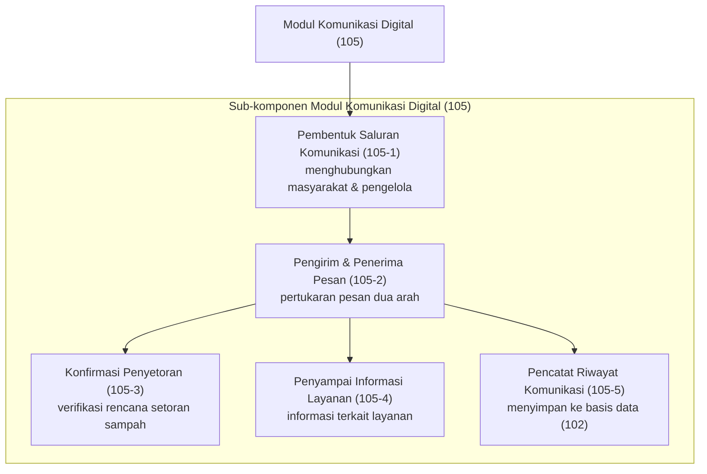

**Uraian:** Modul komunikasi digital (105) terdiri atas pembentuk saluran komunikasi (105-1), pengirim & penerima pesan (105-2), konfirmasi penyetoran (105-3), penyampai informasi layanan (105-4), dan pencatat riwayat komunikasi (105-5). Modul ini memungkinkan komunikasi langsung antara masyarakat dengan pengelola bank sampah secara real-time.

---

#### 1.106 — Modul Pengelolaan Data Sampah (106)

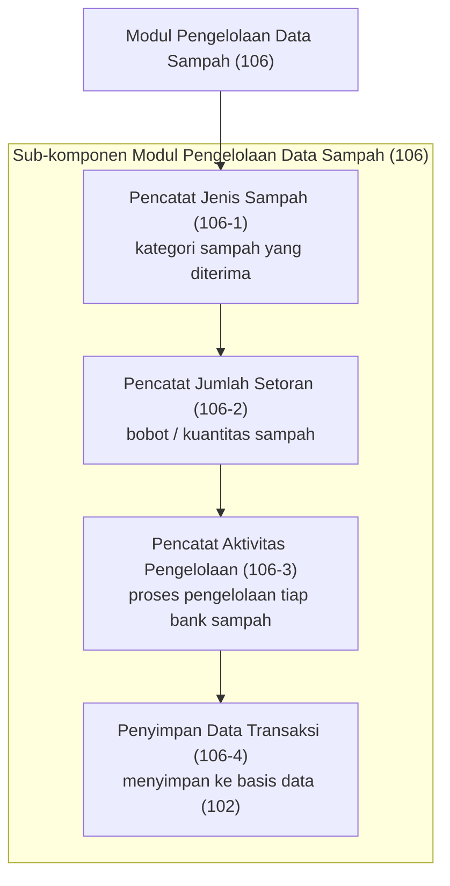

**Uraian:** Modul pengelolaan data sampah (106) terdiri atas pencatat jenis sampah (106-1), pencatat jumlah setoran (106-2), pencatat aktivitas pengelolaan (106-3), dan penyimpan data transaksi (106-4). Modul ini mencatat jenis sampah yang diterima, jumlah sampah yang disetorkan, serta aktivitas pengelolaan yang dilakukan oleh masing-masing bank sampah.

---

#### 1.107 — Modul Pelaporan (107)

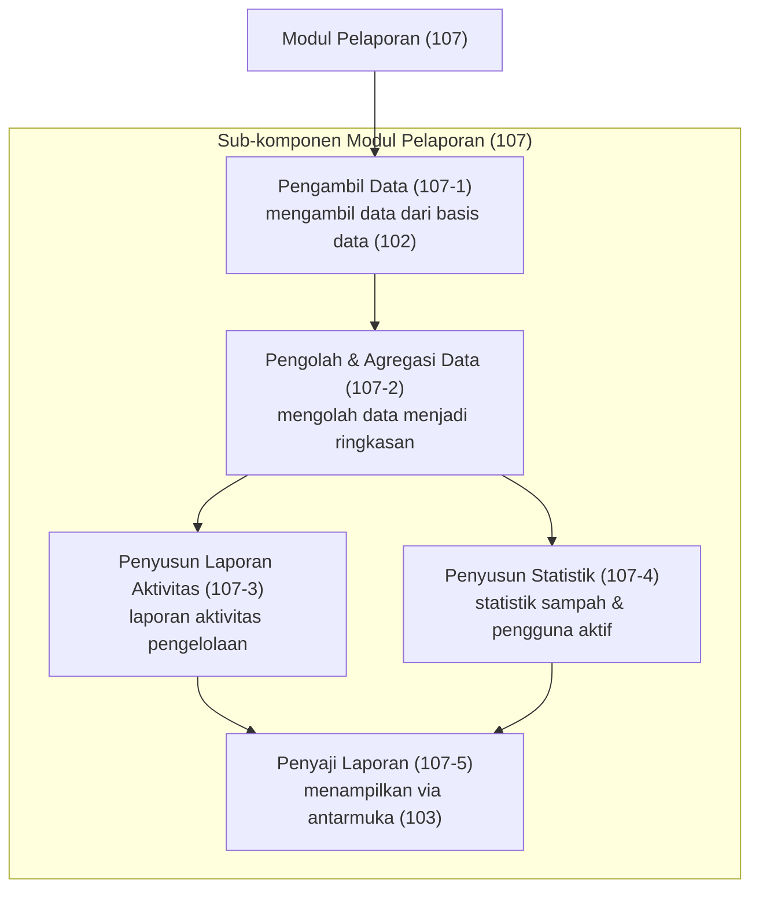

**Uraian:** Modul pelaporan (107) terdiri atas pengambil data (107-1), pengolah & agregasi data (107-2), penyusun laporan aktivitas (107-3), penyusun statistik (107-4), dan penyaji laporan (107-5). Modul ini menghasilkan laporan aktivitas, statistik pengelolaan sampah, jumlah pengguna aktif, serta data transaksi yang tersimpan dalam sistem.

---

## Gambar 2 — Diagram Alir Registrasi dan Autentikasi Pengguna

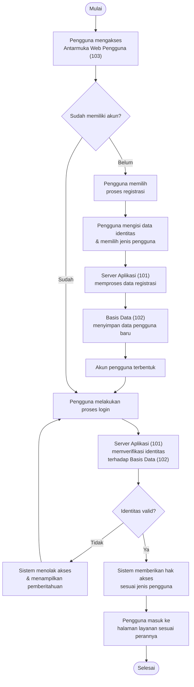

**Uraian:** Pengguna mengakses antarmuka web pengguna (103). Jika belum memiliki akun, pengguna melakukan registrasi yang diproses server aplikasi (101) dan disimpan pada basis data (102). Pada saat login, server aplikasi (101) memverifikasi identitas terhadap basis data (102) dan memberikan hak akses sesuai jenis pengguna.

---

## Gambar 3 — Diagram Alir Pencarian Bank Sampah Berdasarkan Lokasi Pengguna

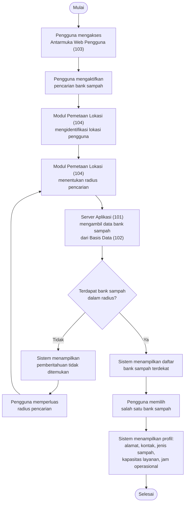

**Uraian:** Modul pemetaan lokasi (104) mengidentifikasi lokasi pengguna dan menentukan radius pencarian. Server aplikasi (101) mengambil data bank sampah dari basis data (102) yang berada dalam radius tersebut, lalu menampilkan daftarnya. Setiap bank sampah memiliki profil informasi yang memuat alamat, kontak, jenis sampah yang diterima, kapasitas layanan, dan jam operasional.

---

## Gambar 4 — Diagram Alir Komunikasi antara Masyarakat dan Pengelola Bank Sampah

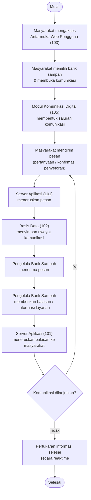

**Uraian:** Modul komunikasi digital (105) membentuk saluran komunikasi langsung antara masyarakat dengan pengelola bank sampah. Server aplikasi (101) meneruskan pesan dan basis data (102) menyimpan riwayat komunikasi. Komunikasi mencakup pertukaran pesan, konfirmasi penyetoran sampah, dan penyampaian informasi layanan secara real-time.

---

## Gambar 5 — Diagram Alir Pengelolaan Data dan Pelaporan Aktivitas Persampahan

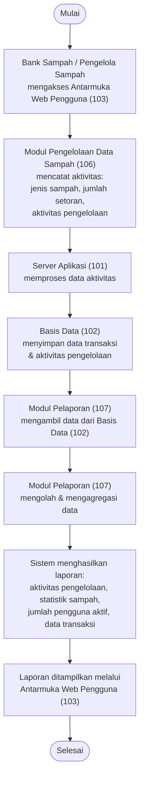

**Uraian:** Modul pengelolaan data sampah (106) mencatat jenis sampah yang diterima, jumlah sampah yang disetorkan, serta aktivitas pengelolaan, yang kemudian disimpan pada basis data (102) melalui server aplikasi (101). Modul pelaporan (107) mengambil dan mengolah data tersebut untuk menghasilkan laporan aktivitas, statistik pengelolaan sampah, jumlah pengguna aktif, serta data transaksi, yang ditampilkan melalui antarmuka web pengguna (103).

---

## Daftar Komponen (Referensi Penomoran)

| No. | Komponen | Fungsi |
|---|---|---|
| **101** | Server Aplikasi | Mengelola seluruh proses pertukaran data dan komunikasi antar pengguna sistem |
| **102** | Basis Data | Menyimpan data pengguna, data bank sampah, data jenis sampah, data transaksi, serta riwayat komunikasi |
| **103** | Antarmuka Web Pengguna | Sarana akses sistem melalui komputer maupun telepon pintar yang terhubung internet |
| **104** | Modul Pemetaan Lokasi | Mengidentifikasi lokasi pengguna dan menampilkan bank sampah dalam radius tertentu |
| **105** | Modul Komunikasi Digital | Memungkinkan komunikasi langsung antara masyarakat dengan pengelola bank sampah |
| **106** | Modul Pengelolaan Data Sampah | Mencatat jenis, jumlah, dan aktivitas pengelolaan sampah |
| **107** | Modul Pelaporan | Menghasilkan laporan aktivitas, statistik, jumlah pengguna aktif, dan data transaksi |
